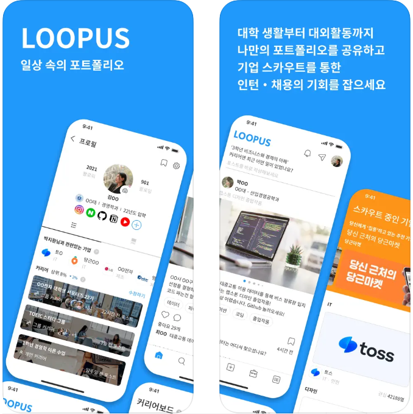

<h1> 🤝 Loop Us 🤝 </h1>
<h3> 일상속 포트폴리오 루프어스 </h3>

<h3> 🧑‍🤝‍🧑 Loop Us는 취업시장 판도의 변경에 따른 새로운 구인 구직 플랫폼 입니다. 
SNS 형식의 플랫폼으로 기존의 딱딱한 플랫폼들과 달리 친근하게 활동을 할 수 있습니다.</h3>

 [google play store link](https://play.google.com/store/apps/details?id=com.loopus.loopus)

 [app store link](https://apps.apple.com/kr/app/%EB%A3%A8%ED%94%84%EC%96%B4%EC%8A%A4/id1603358083)

 

## 🛠️ Stacks

 

 

 

## ✨ 화면 구성

| 1. 메인 화면           | 2. 회원가입 화면 |3-1. 프로필 화면 1|
|---------------------|---|---|
|  |||

| 3-2. 프로필 화면2           | 4. 메세지 화면|5. 알림 화면|
|---------------------|---|---|
||||

| 6. 검색 화면           | 7. 랭킹 화면 |
|---------------------|---|
|||

 

## ✨ 구현 내용
- db 스키마 설계
- 유저, 피드, 댓글, 이미지, 태그 CRUD, 유저 랭킹 시스템 구현
- 인증번호 회원가입, 세션 방식 로그인 구현
- 뉴스 데이터 크롤링 scheduler 구현
- elasticsearch 검색엔진 구현
- ec2 서버 배포

## ✨ 주요 기능

### 1. 인증번호 회원가입, 세션 방식 로그인 구현

학교 이메일 인증을 위한 인증번호 입력 방식의 회원가입 절차와  
drf token을 사용하여 세션 방식의 로그인을 구현했습니다.

> 1. django email backend를 사용하여 인증 번호가 포함된 인증용 이메일을 전송합니다.
> 2. 전송 이후 email을 키, 인증 번호를 value로 하여 redis에 저장합니다.
> 3. 유저가 인증번호를 입력 시 email을 함께 보내 두 정보를 비교하여 다음 절차로 넘어가게 합니다.

### 2. 뉴스 데이터 크롤링 scheduler 구현

사용자들과 자주 사용하는 태그를 바탕으로  
매일 뉴스, 동영상, 블로그 글을 크롤링하도록 스케쥴링 했습니다.

> 1. selenium을 사용하여 최근 사용횟수가 많은 태그를 구글 뉴스, 카카오 브런치에 검색합니다.
> 2. 컨텐츠들의 url, 작성자 등의 정보를 db에 저장합니다.
> 3. youtube api를 사용하여 태그를 검색하여 videoId 값을 db에 저장합니다.
> 4. 해당 과정을 apscheduler에 적용하여 매일 진행하도록 스케쥴링 합니다.

#### 문제 해결
> test 단계에서 문제가 없었으나, 서비스 단계에서 스케쥴링이 중복으로 실행되는 문제가 발생했었습니다. 
> gunicorn에서 설정한 worker마다 설정했던 스케쥴링을 실행했기 때문이었고, 
> 이를 해결하기 위해 크롤링 기능을 restful한 api로 만들고 스케쥴링을 적용하여 
> 해당 api를 호출하는 python 스크립트를 따로 만들어 system daemon으로 관리하였습니다.

### 3. 유저 랭킹 시스템 구현

지난 한 달간 포스팅 수, 좋아요 수, 조회수 등을 조합해 점수를 계산하여  
전국과 교내 랭킹을 집계하도록 api를 만들고 스케쥴링 했습니다.

#### 문제 해결
> 해당 과정을 처음 구현했을 때 유저수가 적었음에도 1분 이상 시간이 걸렸습니다. 
> 랭킹을 집계하는 서버가 따로 있지 않았기 때문에 해당 시간을 줄이려 노력했습니다.
>
> django orm의 prefetch, select related와 annotate등을 활용하여 점수를 db에서 계산하도록 하였고,
> dictionary 자료구조를 활용하여 전국, 교내 랭킹을 집계할 때 for loop를 한 번만 돌도록 했습니다.

## ✨ 후기

해당 프로젝트를 진행하면서 aws의 cloud 기술들을 처음 사용해 봤습니다. 
아무 도움 없이 혼자 해결하느라 시행착오가 있었지만, 기능을 사용해보면서 
cloud 기술의 편리함과 필요성을 알았고, 로컬 서버와 비교해 장단점을 고민해봤습니다.  
api들을 문서화 한 것으로 매주 1~2번 비개발자, 프론트엔드 개발자와 함께 회의를 진행하여  
의사소통과 피드백 과정이 원활하게 이뤄질 수 있었습니다.  
cloud기술 뿐만 아니라 elasticsearch나 redis 등 처음 들어본 기술을 스터디 하고 
바로 적용해 '새로운 기술'에 대한 두려움을 떨칠 수 있었습니다.
